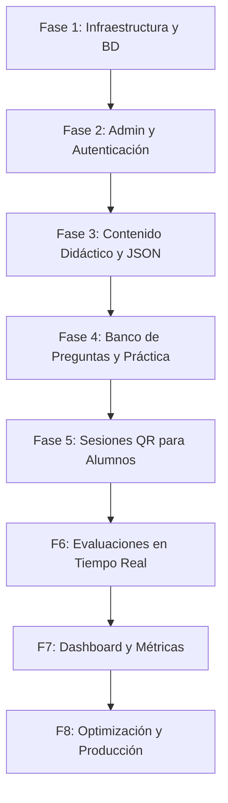

# Plan de Desarrollo y Roadmap (Ruta de Trabajo)

Este documento detalla el plan paso a paso para el desarrollo completo de la **Plataforma de Aprendizaje de Matemáticas CCH - UNAM**. Sigue las directrices y reglas del proyecto establecidas en [00_MASTER_DOCUMENTACION.md](file:///Users/oscarr/Documents/GitHub/asesor_estudio/instrucciones/00_MASTER_DOCUMENTACION.md).

---

## Estructura General del Plan

El desarrollo se organizará en **8 fases incrementales**. Cada fase tiene entregables específicos y pruebas de aceptación para asegurar la calidad antes de pasar a la siguiente etapa.

---

## Fase 1: Configuración de Infraestructura y Base de Datos

**Objetivo:** Establecer la arquitectura del sistema, los repositorios y el esquema inicial de base de datos.

### Acciones del Desarrollador:
1. **Configuración del Backend (Laravel 12):**
   - Inicializar el proyecto Laravel en `/app` utilizando la estructura API REST.
   - Configurar variables de entorno (`.env`) y la conexión a la base de datos MariaDB.
   - Instalar Laravel Sanctum o Laravel Breeze API para el manejo de sesiones del administrador.
2. **Configuración del Frontend (React + Vite + Tailwind CSS):**
   - Inicializar la SPA en React.
   - Configurar el router inicial y la guía de estilos de Figma descrita en [DESIGN.md](file:///Users/oscarr/Documents/GitHub/asesor_estudio/instrucciones/DESIGN.md).
   - Instalar librerías de soporte inicial (MathJax/KaTeX para LaTeX, Axios, Tailwind CSS).
3. **Esquema de Base de Datos (MariaDB):**
   - Crear migraciones para catálogos:
     - `cat_materias`, `cat_semestres`, `cat_unidades`, `cat_temas`, `cat_subtemas`.
   - Crear migraciones para los modelos académicos:
     - `generaciones`, `grupos`, `alumnos` (datos de lista de asistencia).
   - Configurar Seeders iniciales con la estructura de materias (Matemáticas I a IV) cargada desde el catálogo oficial definido en [00_MASTER_DOCUMENTACION.md](file:///Users/oscarr/Documents/GitHub/asesor_estudio/instrucciones/00_MASTER_DOCUMENTACION.md#temario-de-matematicas-cch).

**Entregables:**
- Backend Laravel y Frontend React corriendo localmente.
- Esquema de base de datos migrado en MariaDB.

---

## Fase 2: Autenticación e Infraestructura Administrativa

**Objetivo:** Desarrollar el panel donde el único administrador (profesor) gestionará la escuela y el contenido.

### Acciones del Desarrollador:
1. **API de Autenticación:**
   - Implementar endpoints para login, logout y validación de token de sesión.
   - Crear un middleware de seguridad para asegurar las rutas `/api/admin/*`.
2. **Backend de Administración Escolar:**
   - Desarrollar controladores CRUD y recursos API para:
     - **Generaciones** (ej. 2026, 2027)
     - **Grupos** (ej. 401, 402)
     - **Listas de Alumnos** (Carga masiva mediante archivo CSV o Excel).
3. **Frontend del Panel Administrativo (UI/UX):**
   - Crear la interfaz de inicio de sesión del profesor.
   - Diseñar el panel de navegación (Dashboard sidebar) con la estética minimalista de [DESIGN.md](file:///Users/oscarr/Documents/GitHub/asesor_estudio/instrucciones/DESIGN.md) (uso estratégico de bloques de color pastel y contrastes negros).
   - Formulario de carga y visualización de alumnos por grupo.

**Entregables:**
- Login de administrador completamente funcional.
- Interfaz para cargar, ver y administrar listas de alumnos y grupos.

---

## Fase 3: Motor de Contenido Didáctico y Versionado JSON

**Objetivo:** Cargar y mostrar la teoría matemática a visitantes generales y alumnos de manera atractiva y con fórmulas perfectamente legibles.

### Acciones del Desarrollador:
1. **Diseño de Contenido (JSON):**
   - Definir el esquema JSON estandarizado para las unidades según la estructura pedagógica de [06_CONTENIDO_DIDACTICO.md](file:///Users/oscarr/Documents/GitHub/asesor_estudio/instrucciones/06_CONTENIDO_DIDACTICO.md).
   - Crear los archivos JSON base correspondientes a las unidades de Matemáticas I a IV en el directorio `/storage/content/`.
2. **API de Lectura de Contenido:**
   - Crear servicios en Laravel que lean, analicen y sirvan la estructura del contenido JSON al frontend.
   - Cachear las respuestas del contenido para maximizar el rendimiento.
3. **Frontend de Contenido Público:**
   - Página principal de materias y niveles.
   - Visor de lecciones con soporte integrado para LaTeX (`KaTeX` o `MathJax`) para que expresiones complejas como \(y = mx + b\) y matrices se rendericen con alta calidad.
   - Diseñar la vista de forma responsiva y adaptable a móviles para consulta en salón de clases.

**Entregables:**
- API de contenido didáctico consumiendo archivos JSON.
- Visor de teoría y lecciones públicas con renderizado de fórmulas matemáticas.

---

## Fase 4: Banco de Preguntas y Cuestionarios de Práctica

**Objetivo:** Permitir que cualquier visitante practique libremente con cuestionarios adaptativos y con límites de intentos diarios.

### Acciones del Desarrollador:
1. **Modelado del Banco de Preguntas:**
   - Migraciones para `preguntas` (con soporte para texto en LaTeX, tipo de opción múltiple, reactivos de opción única o abierta) y `recursos` asociados.
   - Desarrollar CRUD administrativo en React para gestionar preguntas por unidad/tema.
2. **Motor de Cuestionarios en Backend:**
   - Algoritmo en API para seleccionar y ordenar preguntas de forma aleatoria por unidad.
3. **Regla de Negocio (3 Intentos Diarios):**
   - Implementar el registro de intentos en la base de datos (o localmente para usuarios no autenticados utilizando localStorage/cookies vinculados a la IP/identificador del navegador).
   - Pantalla con retroalimentación motivacional al alcanzar el límite diario.
   - Calificación preliminar instantánea de cuestionarios de práctica.

**Entregables:**
- CRUD de banco de preguntas.
- Simulador de cuestionarios con selección aleatoria de reactivos.
- Bloqueo y control del límite de 3 intentos diarios.

---

## Fase 5: Acceso por Código / QR (Modelo sin cuentas de alumno)

**Objetivo:** Permitir que los alumnos ingresen a evaluaciones de forma inmediata en el aula física, sin requerir contraseñas.

### Acciones del Desarrollador:
1. **Controlador de Sesiones (Backend):**
   - Crear el modelo `sesiones` vinculando un grupo, una evaluación y un código corto aleatorio único (ej. `A7B9`).
   - Generación de código QR dinámico utilizando librerías nativas de PHP o React.
2. **Flujo de Acceso del Alumno (Frontend):**
   - Interfaz simplificada de bienvenida (`/sesion` o `/acceso`).
   - Escaneo de código QR mediante cámara móvil o entrada de código manual de 4 dígitos.
   - Pantalla de identificación: Selección de grupo y número de lista (o nombre completo cargado previamente).
   - Validar que el alumno no tenga ya un intento finalizado para esa sesión.

**Entregables:**
- Generador de códigos QR para el docente.
- Portal de inicio rápido para alumnos desde dispositivos móviles.

---

## Fase 6: Evaluaciones y Calificaciones Síncronas / Asíncronas

**Objetivo:** Habilitar el flujo completo de exámenes controlados por el profesor y su posterior revisión.

### Acciones del Desarrollador:
1. **Controles del Examen:**
   - Controles de tiempo (límite en minutos, reloj dinámico en pantalla).
   - Lógica en el backend para cerrar la sesión automáticamente y enviar respuestas cuando expire el tiempo o la fecha límite establecida por el docente.
2. **Pantalla del Alumno durante Evaluación:**
   - Interfaz limpia y enfocada, previniendo salidas accidentales del navegador (guardado automático de respuestas parciales en la base de datos).
3. **Flujo de Calificación Docente:**
   - Procesamiento de respuestas automáticas en el backend.
   - Panel de calificación manual para preguntas abiertas.
   - Aprobación docente antes de enviar la calificación definitiva al alumno (Regla de Negocio).

**Entregables:**
- Panel de control de evaluaciones (abrir/cerrar exámenes).
- Interfaz del alumno para responder exámenes con cronómetro.
- Módulo de revisión y asignación de calificación definitiva.

---

## Fase 7: Dashboard del Docente y Reportes de Rendimiento

**Objetivo:** Proporcionar al profesor analíticas visuales completas sobre sus grupos y alumnos.

### Acciones del Desarrollador:
1. **Visualizaciones con Chart.js:**
   - Gráfica de distribución de calificaciones.
   - Estadísticas de preguntas con mayor porcentaje de error por grupo.
   - Historial de avance académico por generación y grupo.
2. **Dashboard de Monitoreo:**
   - Panel de control en tiempo real con alumnos conectados activamente durante una evaluación.
   - Métricas clave: promedio grupal, índice de aprobación y tiempo promedio de resolución.
3. **Exportación de Datos:**
   - Endpoint y botón en frontend para descargar las listas de calificaciones en formato Excel (CSV) compatibles con el sistema administrativo del CCH.

**Entregables:**
- Panel analítico e interactivo (Dashboard) para el profesor.
- Exportador de reportes en formato CSV.

---

## Fase 8: Optimización, Seguridad y Despliegue en Producción

**Objetivo:** Pulir detalles de rendimiento, auditar la seguridad y desplegar el sistema en servidores listos para producción.

### Acciones del Desarrollador:
1. **Optimización Web:**
   - Compilación del frontend y optimización de assets con Vite.
   - Caching de las respuestas de API que no cambian (catálogos y lecciones didácticas).
2. **Auditoría de Seguridad:**
   - Protección contra inyección SQL, XSS y CSRF en el backend de Laravel.
   - Pruebas de carga simulando múltiples alumnos accediendo concurrentemente a una evaluación.
3. **Despliegue (Producción):**
   - Configuración de servidores Apache/Nginx para alojar la API de Laravel y la SPA de React.
   - Configuración de certificados SSL/HTTPS (Let's Encrypt).
   - Proceso de validación de contenido didáctico antes de su puesta en marcha oficial.

**Entregables:**
- Plataforma pública con certificados de seguridad.
- Systema optimizado y listo para su uso por parte de grupos escolares reales del CCH.

---

## Estrategia de Pruebas y Control de Calidad

Para cada entrega o fase del desarrollo se seguirán las siguientes políticas de pruebas:
- **Unitarias (Laravel):** Pruebas unitarias de los algoritmos de selección de preguntas y cálculo de intentos.
- **De Integración (API):** Validación de todos los endpoints documentados en `07_API.md` (por ejemplo, accesos con tokens válidos/inválidos, envíos de exámenes duplicados).
- **Manuales / UX:** Verificación en navegadores móviles (Safari, Chrome) para asegurar que el portal de alumnos es fácil de usar bajo redes móviles escolares estándar.
